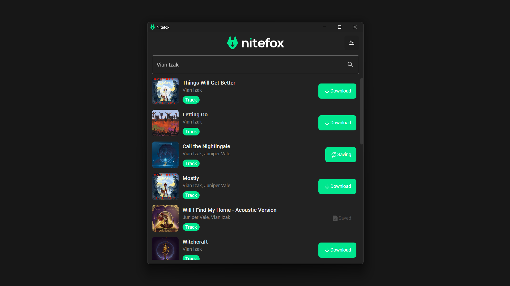

<h2 align="center">NiteFox - Spotify Downloader</h2>

A clean and modern app to download your favorite Spotify tracks, albums and playlists for offline listening.
With Nitefox, you can easily download entire spotify playlists or individual tracks with just a single click!

<h3 align="center">Features</h3>

- **Search and audio preview**
- **Song downloads**
- **Playlist and Album Downloads**
- **Simultaneous Downloading**

<h3 align="center">Supported Platforms</h3>

#### Desktop

- [x] Windows (Installer, Portable)
- [x] Linux (Deb, RPM, AppImage)
- [ ] Mac/Metal (Build supported, not yet tested)

#### Mobile

- [ ] Android (Planned)
- [ ] IOS (Planned)

<h3 align="center">Donate ️</h3>

This project is done freely, and made available for the community to use.
But creating and maintaining software takes time. Donating to this project not only
supports its development, it also helps me afford more time to create tools like this
for the community. ❤

> **Note**
> Nitefox does not download from spotify directly due to restrictions and copyright. What it does is find out if it is available
> as a video in youtube and fetch the audio stream for download automatically. Nitefox is only for personal, non-commercial use. Its creators are not liable for any abuse or misuse of the software
